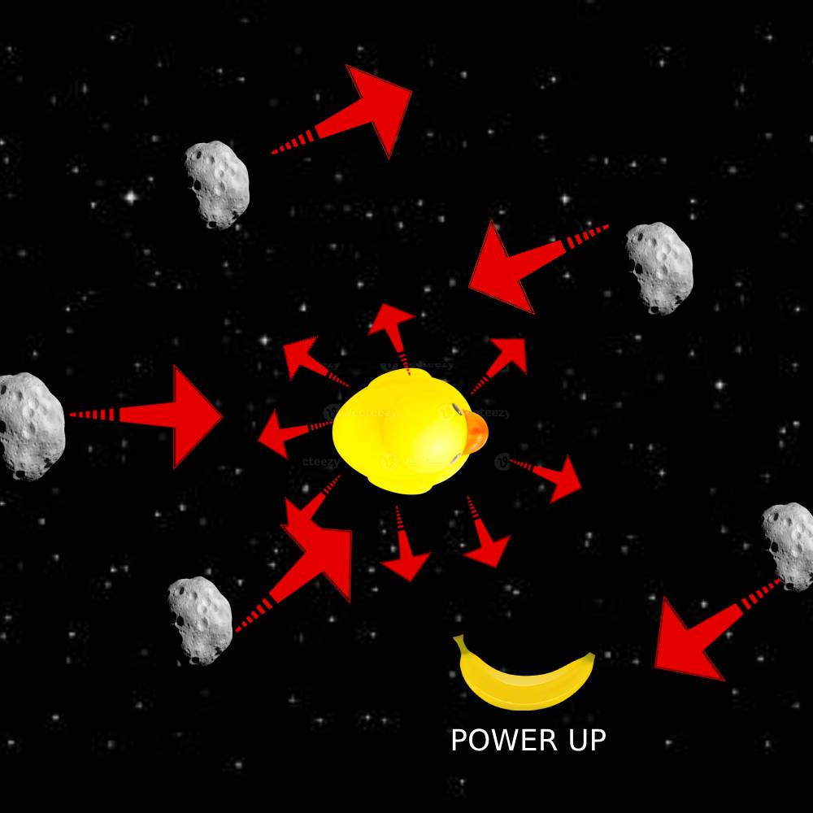

#Team Name: 
Dunking Ducks

#Project Name:
Duck 'n' Dodge

CS110 B1 Final Project  << Fall Semester, 2024 >>

#Team Members: 
1. Kevin Cai
2. Denis Khrapko

#Project Description:
User must move his player 2-dimensionally in order to dodge asteroids. The asteroids will spawn in at random trajectories, speeds, and with increasing frequency. Randomly spawning power-ups can also be implemented to increase players speed or grant invincibility briefly. The player will earn 1 point for each second survived, and will play for a high score.

#Program Design - Features:
1. Start Menu
2. Moveing Asteroids
3. Moving character must avoid collisions with asteroids
4. Power-ups that change player's state
4. Game Over Screen
5. Score Keeping

### Classes
<< You should have a list of each of your classes with a description >>

# class Player
- The Player class represents the player's character in the game, which can be moved in all four directions and drawn on the game screen

# class Asteroid
- The Asteroid class represents an asteroid in the game, which moves downward at a specified speed and can be drawn on the game screen

# class Powerup
- The PowerUp class represents a collectible item in the game that has a position on the screen and an associated effect. The class provides methods to update its position (moving downward) and to draw it on the game screen.

# class Controller
- The Controller class is responsible for managing the overall game logic, including handling user input, updating game objects, and rendering the game screen

:warning: Everything between << >> needs to be replaced (remove << >> after replacing)

## GUI Design

### Initial Design

### Final Design

## ATP

Acceptance Test Procedure List
Program Name: Duck 'n' Dodge

#Test Case 1: controller.py (Player Movement)
Test Description: Ensure that the user (Duck) can move freely: left, right, up, and down.

Test Steps:
1. Start the program.
2. Press the keyboard buttons arrow keys to move up, left, down, and right.
3. Verify that the user (Duck) can move accordingly to each key button.
4. Repeat each button until it satisfies the previous step conditions.

Expected Outcome:
The player's Duck should move move up, left, down, and right in response to the arrow key inputs.

#Test Case 2: asteroid.py (Collision Detection) 
Test Description: Confirm that collisions between the player's body (Duck) and randomly generated asteroids are detected correctly.

Test Steps:
1. Start the program.
2. Move the user freely first, purposely avoiding the asteroids.
3. Verify that the program doesn't stop while maintaining no contact with any asteroids.
4. Purposely collide the user's body with an asteroid.
5. Verify that collision is detected.
6. The program should stop if a collision is in contact.
7. The "game over" screen would be displayed at the end.

Expected Outcome:
The asteroids will be the game's enemies, trying to ruin the user's score. 

#Test Case 3: Score Counting System
Test Description: Ensure the game has a purpose for players to play and compete.

Test Steps:
1. Start the program.
2. Observe the points at the top left of the screen.
3. The longer the user avoids collision with any asteroids, the higher the points will increase.
4. Purposely collide with the asteroids.
5. The program should stop, and the "game over" screen should display the total points earned.

Expected Outcome:
The points will gradually increase over time, and once the players lose all their lives, the game screen will display the points they earned.

#Test Case 4: Game Over Screen
Test Description: Verify that the game ends with the points earned when the player loses all their lives.

Test Steps:
1. Start the program.
2. Purposely collide with the asteroids until the player loses all their lives.
3. Verify that the game displays a "Game Over" message.
4. As well as the total points earned, 

Expected Outcome: 
The game should display a "Game Over" message and the total points earned when the player loses all their lives.

#Test Case 5: powerup.py (Power-ups for Players)
Test Description: Confirm that the powerups will assist the players in gameplay and performance. 

Test Steps:
1. Start the program.
2. Make sure the player avoids contact with any asteroids.
3. A power-up will eventually be generated in the program.
4. The player will have a choice to collide with the power-up (In this case, they collide with it)
5. Players will become either faster or smaller based on the power-up they collided with.
6. Verify that the collision between player and power-ups will have immediate and limited effects.

Expected Outcome:
Once the player touch the power-up, it will ultimately help them maintain more points by being smaller (harder to hit asteroids) or faster (fast to avoid asteroids). 

